# Polestar Journey Log Explorer - Architecture Documentation

**Author**: Kinn Coelho Juliao  
**Date**: November 21, 2025

## Overview

The Polestar Journey Log Explorer is a client-side web application designed to provide comprehensive analysis and visualization of electric vehicle journey data. Built with modern web technologies, it offers an intuitive interface for EV owners to understand their driving patterns, energy consumption, and trip efficiency.

## Architecture Philosophy

This application follows a pure client-side architecture, ensuring:
- **Privacy**: All data processing happens in the browser - no data is sent to servers
- **Simplicity**: No backend infrastructure required
- **Portability**: Can be hosted on any static file server or CDN
- **Performance**: Direct file parsing and in-memory data processing

## Technology Stack

### Core Framework
- **React 18.3.1**: Modern UI framework with hooks for state management
- **Vite 5.4.9**: Next-generation build tool providing fast HMR and optimized builds

### UI Components
- **Mantine UI 7.13.2**: Comprehensive component library
  - `@mantine/core`: Core components (buttons, inputs, layouts)
  - `@mantine/hooks`: Useful React hooks
  - `@mantine/charts`: Chart wrapper components
  - `@mantine/notifications`: Toast notifications
  - `@mantine/dropzone`: File upload component
- **Tabler Icons**: Icon library for consistent UI elements

### Data Processing
- **PapaParse 5.4.1**: CSV parsing with streaming support
- **XLSX 0.18.5**: Excel file parsing (both .xls and .xlsx)
- **DayJS 1.11.13**: Date manipulation and formatting

### Visualization
- **Recharts 2.12.7**: Composable charting library
  - Line charts for time series data
  - Bar charts for distribution analysis
  - Pie charts for categorical data
- **OpenLayers (ol)**: Interactive map library with multiple tile layer support
- **ol-ext**: OpenLayers extensions for additional controls

## System Architecture

```mermaid
graph TB
    subgraph Browser["🌐 Browser Environment"]
        subgraph UI["React Application"]
            App[App Component<br/>State Management]
            
            subgraph Upload["📁 Upload Layer"]
                FileUpload[FileUploader Component<br/>Drag & Drop Interface]
            end
            
            subgraph Processing["⚙️ Data Processing"]
                Parser[Data Parser<br/>CSV/XLSX Processing]
                Stats[Statistics Calculator<br/>Metrics & Analytics]
            end
            
            subgraph Visualization["📊 Visualization Layer"]
                Dashboard[Dashboard Component<br/>Tab Navigation]
                StatsCards[Statistics Cards<br/>Key Metrics Display]
                Charts[Charts View<br/>Recharts Integration]
                Map[Map View<br/>OpenLayers Maps]
                Table[Table View<br/>Data Grid]
            end
        end
        
        subgraph Storage["💾 Storage"]
            State[React State<br/>In-Memory Data]
            LocalFile[User's Local Files<br/>CSV/XLSX]
            LocalStorage[localStorage<br/>Trip Annotations]
        end
    end
    
    subgraph External["🌍 External Services"]
        OSM[OpenStreetMap<br/>Map Tiles]
        Stadia[Stadia Maps<br/>Retina Tiles]
        CDN[CDN Resources<br/>Icons & Fonts]
        Nominatim[Nominatim API<br/>City Autocomplete]
    end
    
    LocalFile -->|User Upload| FileUpload
    FileUpload -->|File Object| Parser
    Parser -->|Parsed Data| Stats
    Parser -->|Journey Records| State
    Stats -->|Calculated Metrics| State
    State -->|Data Flow| Dashboard
    Dashboard --> StatsCards
    Dashboard --> Charts
    Dashboard --> Map
    Dashboard --> Table
    Map -.->|Fetch Tiles| OSM
    Map -.->|Fetch Tiles| Stadia
    StatsCards -.->|City Search| Nominatim
    Table <-.->|Read/Write| LocalStorage
```



## Component Architecture

### 1. App Component (Root)
- **Responsibility**: Application shell and state management
- **State**: Journey data and upload status
- **Layout**: Mantine AppShell with header and main content area

### 2. FileUploader Component
- **Responsibility**: File input and parsing
- **Features**:
  - Drag-and-drop interface
  - CSV and XLSX support
  - File validation
  - Error handling with user feedback
- **Output**: Parsed and processed journey data

### 3. Dashboard Component
- **Responsibility**: Main data visualization container
- **Features**:
  - Tab-based navigation
  - Statistics overview
  - Sub-component orchestration
- **Children**: StatsCards, ChartsView, MapView, TableView

### 4. StatsCards Component
- **Responsibility**: Display key metrics
- **Metrics Displayed**:
  - Total trips
  - Total distance
  - Total consumption
  - Average/Best/Worst efficiency
  - Average trip distance
  - Odometer range

### 5. ChartsView Component
- **Responsibility**: Data visualization through charts
- **Charts**:
  - Daily distance and consumption (line chart)
  - Trip distance distribution (pie chart)
  - Efficiency per trip (bar chart)
  - Battery SOC changes (line chart)
  - Daily trip count (bar chart)

### 6. MapView Component
- **Responsibility**: Geographic visualization
- **Features**:
  - Interactive map with trip routes
  - Multiple tile layer options (OpenStreetMap, Stadia Maps, Vector Tiles)
  - Start/end markers with popups (circles for start, stars for end)
  - Color-coded efficiency indicators
  - Advanced controls (scale line, zoom to extent, fullscreen, mouse position)
  - Day linking with dashed connection lines
  - Trip count selector
  - Performance optimization with vector layers

### 7. TableView Component
- **Responsibility**: Tabular data display
- **Features**:
  - Searchable data
  - Sortable columns
  - Filterable results
  - Color-coded efficiency badges

## Data Flow


## Data Model

### Journey Record Structure

```javascript
{
  id: number,                  // Unique identifier
  startDate: string,           // "YYYY-MM-DD, HH:mm"
  endDate: string,             // "YYYY-MM-DD, HH:mm"
  startAddress: string,        // Full address
  endAddress: string,          // Full address
  distanceKm: number,          // Distance in kilometers
  consumptionKwh: number,      // Energy consumption in kWh
  category: string,            // Trip category
  startLat: number,            // Start latitude
  startLng: number,            // Start longitude
  endLat: number,              // End latitude
  endLng: number,              // End longitude
  startOdometer: number,       // Odometer reading at start
  endOdometer: number,         // Odometer reading at end
  tripType: string,            // "SINGLE", etc.
  socSource: number,           // Battery % at start
  socDestination: number,      // Battery % at end
  comments: string,            // User comments
  efficiency: number,          // Calculated: kWh/100km
  socDrop: number              // Calculated: SOC difference
}
```

### Statistics Model

```javascript
{
  totalTrips: number,
  totalDistance: number,        // km
  totalConsumption: number,     // kWh
  avgEfficiency: number,        // kWh/100km
  bestEfficiency: number,       // kWh/100km
  worstEfficiency: number,      // kWh/100km
  avgTripDistance: number,      // km
  odometerStart: number,        // km
  odometerEnd: number          // km
}
```

## Build and Deployment

### Development Build
```bash
npm run dev
```
- Starts Vite dev server with HMR
- Accessible at `http://localhost:5173`

### Production Build
```bash
npm run build
```
- Minifies and bundles application
- Optimizes assets
- Generates static files in `dist/`

### Deployment Options

#### 1. GitHub Pages (via GitHub Actions)
- Automatic deployment on push to main branch
- Uses GitHub Actions workflow
- No manual deployment needed

#### 2. Manual GitHub Pages Deployment
```bash
npm run deploy
```
- Uses `gh-pages` package
- Pushes build to `gh-pages` branch

#### 3. Any Static Host
- Deploy `dist/` folder to:
  - Netlify
  - Vercel
  - AWS S3 + CloudFront
  - Azure Static Web Apps
  - Google Cloud Storage

## Performance Considerations

### File Processing
- Large files (>1000 trips) are processed in chunks
- Web Workers could be added for better performance
- Currently handles 100+ trips smoothly

### Map Rendering
- Limits displayed trips to 50 by default
- Allows selection of individual trips
- Uses lightweight markers and polylines

### Data Caching
- Parsed data kept in React state
- Statistics calculated with `useMemo`
- Chart data memoized to prevent recalculation

### Bundle Size Optimization
- Tree-shaking enabled via Vite
- Code splitting for routes (if added)
- Lazy loading for heavy components

## Security Considerations

### Client-Side Only
- No data transmission to servers
- No API keys or credentials needed
- User data never leaves their device

### Input Validation
- File type validation
- Data format validation
- Error handling for malformed data

### XSS Prevention
- React automatically escapes content
- No `dangerouslySetInnerHTML` usage
- Sanitized user inputs

## Browser Compatibility

### Minimum Requirements
- Modern browsers (Chrome 90+, Firefox 88+, Safari 14+, Edge 90+)
- JavaScript enabled
- localStorage support (for future features)

### Progressive Enhancement
- Graceful degradation for older browsers
- Fallback UI for unsupported features
- Clear error messages

## Future Enhancements

### Planned Features
1. **Data Export**: Export analyzed data and reports
2. **Comparison Mode**: Compare multiple log files
3. **Advanced Filters**: Time range, efficiency range, location filters
4. **Heatmaps**: Density maps for frequently visited areas
5. **Route Optimization**: Suggest more efficient routes
6. **Carbon Footprint**: Compare with gas vehicles
7. **Custom Categories**: User-defined trip categories
8. **Data Persistence**: Save analysis in browser storage

### Technical Improvements
1. **Web Workers**: Offload parsing to background threads
2. **Virtual Scrolling**: Handle thousands of trips efficiently
3. **PWA Support**: Offline functionality
4. **Export to PDF**: Generate reports
5. **Internationalization**: Multi-language support

## Maintenance and Updates

### Dependency Management
- Regular updates for security patches
- Semantic versioning for stable releases
- Lock file committed for reproducible builds

### Testing Strategy
- Component unit tests (to be added)
- Integration tests for data flow
- End-to-end tests for user workflows

### Monitoring
- Error boundary for graceful error handling
- Analytics (optional, privacy-respecting)
- Performance monitoring

## Contributing Guidelines

### Code Style
- ESLint for JavaScript linting
- Prettier for code formatting
- Consistent component structure

### Git Workflow
1. Fork the repository
2. Create feature branch
3. Commit with descriptive messages
4. Submit pull request
5. Code review and merge

## License

MIT License - Open source and free to use

---

**Kinn Coelho Juliao**  
Building tools for better EV ownership experience
