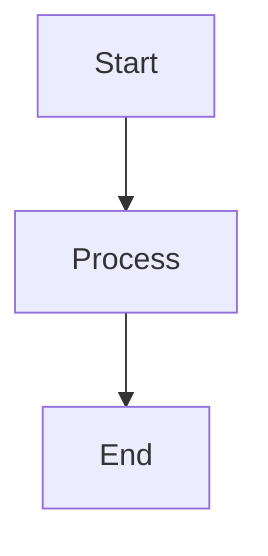

# Contributing to Polestar Journey Log Explorer

First off, thank you for considering contributing to this project! 🎉

**Kinn Coelho Juliao** welcomes contributions from the community. This document provides guidelines to help you contribute effectively.

## 📋 Table of Contents

- [Code of Conduct](#code-of-conduct)
- [How Can I Contribute?](#how-can-i-contribute)
- [Development Setup](#development-setup)
- [Pull Request Process](#pull-request-process)
- [Coding Standards](#coding-standards)
- [Commit Message Guidelines](#commit-message-guidelines)
- [Documentation](#documentation)

## 🤝 Code of Conduct

### Our Pledge

We are committed to providing a welcoming and inclusive environment for everyone. We pledge to:

- Use welcoming and inclusive language
- Be respectful of differing viewpoints
- Accept constructive criticism gracefully
- Focus on what's best for the community
- Show empathy towards other contributors

### Our Standards

Examples of behavior that contributes to a positive environment:

- Being kind and courteous
- Providing constructive feedback
- Accepting responsibility for mistakes
- Focusing on the project goals

Examples of unacceptable behavior:

- Harassment or discriminatory language
- Trolling or insulting comments
- Personal or political attacks
- Publishing others' private information

## 🎯 How Can I Contribute?

### Reporting Bugs

Before submitting a bug report:

1. **Check existing issues** to avoid duplicates
2. **Use the latest version** to ensure the bug still exists
3. **Collect information** about the bug

When submitting a bug report, include:

- **Clear title and description**
- **Steps to reproduce** the issue
- **Expected behavior** vs actual behavior
- **Screenshots** if applicable
- **Environment details** (browser, OS, version)
- **Sample data** if relevant (anonymized)

Example:
```markdown
**Bug**: Map markers not displaying

**Steps to Reproduce**:
1. Upload CSV file with 100+ trips
2. Navigate to Map tab
3. Markers are missing

**Expected**: All trip markers should appear
**Actual**: Map is blank

**Browser**: Chrome 120.0
**OS**: macOS 14.0
```

### Suggesting Features

Before suggesting a feature:

1. **Check existing issues** for similar suggestions
2. **Consider the scope** - does it fit the project goals?
3. **Think about implementation** - is it feasible?

When suggesting a feature, include:

- **Clear use case** - why is this needed?
- **Proposed solution** - how should it work?
- **Alternative solutions** - what else could work?
- **Additional context** - mockups, examples, etc.

### Contributing Code

1. **Fork the repository**
2. **Create a feature branch** from `main`
3. **Make your changes** following our coding standards
4. **Test thoroughly** with different datasets
5. **Update documentation** if needed
6. **Submit a pull request**

### Improving Documentation

Documentation improvements are always welcome! You can:

- Fix typos or grammatical errors
- Clarify confusing sections
- Add examples or screenshots
- Update outdated information
- Translate documentation (future)

## 🛠️ Development Setup

### Prerequisites

- Node.js 18+ and npm
- Git
- A code editor (VS Code recommended)

### Setup Steps

```bash
# 1. Fork and clone
git clone https://github.com/YOUR-USERNAME/polestar-journey-log-explorer.git
cd polestar-journey-log-explorer

# 2. Install dependencies
cd app
npm install

# 3. Start dev server
npm run dev

# 4. Open browser
# Visit http://localhost:5173
```

### Project Structure

```
app/
├── src/
│   ├── components/    # React components
│   ├── utils/         # Utility functions
│   ├── App.jsx        # Main app
│   └── main.jsx       # Entry point
└── package.json
```

## 🔄 Pull Request Process

### Before Submitting

1. **Create a feature branch**
   ```bash
   git checkout -b feature/your-feature-name
   ```

2. **Make your changes**
   - Write clean, readable code
   - Follow existing code style
   - Add comments for complex logic

3. **Test your changes**
   - Test with sample CSV/XLSX files
   - Check all dashboard features
   - Test on different browsers
   - Verify responsive design

4. **Update documentation**
   - Update relevant .md files
   - Add code comments
   - Update diagrams if needed

5. **Commit your changes**
   ```bash
   git add .
   git commit -m "Add feature: your feature description"
   ```

6. **Push to your fork**
   ```bash
   git push origin feature/your-feature-name
   ```

### Submitting the PR

1. Go to the original repository
2. Click "New Pull Request"
3. Select your feature branch
4. Fill in the PR template:

```markdown
## Description
Brief description of changes

## Type of Change
- [ ] Bug fix
- [ ] New feature
- [ ] Documentation update
- [ ] Performance improvement

## Testing
How did you test this?

## Screenshots
If applicable

## Checklist
- [ ] Code follows project style
- [ ] Tests pass
- [ ] Documentation updated
- [ ] No console errors
```

5. Submit and wait for review

### Review Process

1. A maintainer will review your PR
2. Address any requested changes
3. Once approved, your PR will be merged
4. Your contribution will be credited!

## 💻 Coding Standards

### JavaScript/React

#### Component Structure

```jsx
import { useState } from 'react';
import { Paper, Title } from '@mantine/core';

/**
 * Component description
 * @param {Object} props - Component props
 * @param {Array} props.data - Journey data array
 */
function YourComponent({ data }) {
  const [state, setState] = useState(null);

  // Event handlers
  const handleClick = () => {
    // Implementation
  };

  // Render
  return (
    <Paper p="md" withBorder>
      <Title order={3}>Your Component</Title>
      {/* Component content */}
    </Paper>
  );
}

export default YourComponent;
```

#### Naming Conventions

- **Components**: PascalCase (`MyComponent.jsx`)
- **Files**: PascalCase for components, camelCase for utilities
- **Variables**: camelCase (`myVariable`)
- **Constants**: UPPER_SNAKE_CASE (`MAX_VALUE`)
- **Functions**: camelCase (`handleSubmit`)
- **Booleans**: Prefix with `is`, `has`, `should` (`isLoading`)

#### Best Practices

```jsx
// ✅ Good
const [isLoading, setIsLoading] = useState(false);
const data = useMemo(() => processData(rawData), [rawData]);

// ❌ Bad
const [loading, setLoading] = useState(false);
const data = processData(rawData); // Recalculates on every render
```

### Code Style

```jsx
// ✅ Use destructuring
function Component({ data, onUpdate }) {
  // Implementation
}

// ✅ Use arrow functions for simple functions
const processData = (data) => data.filter(item => item.valid);

// ✅ Use template literals
const message = `Loaded ${count} items`;

// ✅ Use optional chaining
const value = data?.items?.[0]?.value;

// ✅ Use async/await over promises
const loadData = async () => {
  try {
    const result = await fetchData();
    return result;
  } catch (error) {
    console.error(error);
  }
};
```

### Performance

```jsx
// ✅ Memoize expensive calculations
const statistics = useMemo(() => 
  calculateStatistics(data), 
  [data]
);

// ✅ Memoize callbacks passed to children
const handleUpdate = useCallback(() => {
  // Implementation
}, [dependencies]);

// ✅ Use proper keys in lists
{items.map(item => (
  <Item key={item.id} data={item} />
))}
```

## 📝 Commit Message Guidelines

### Format

```
<type>(<scope>): <subject>

<body>

<footer>
```

### Types

- **feat**: New feature
- **fix**: Bug fix
- **docs**: Documentation changes
- **style**: Code style changes (formatting)
- **refactor**: Code refactoring
- **perf**: Performance improvements
- **test**: Adding tests
- **chore**: Maintenance tasks

### Examples

```bash
feat(charts): add pie chart for trip distribution

Add a new pie chart showing trip distance distribution
across different ranges (0-5km, 5-10km, etc.)

Closes #123

---

fix(map): resolve marker icon issue

Fix Leaflet default marker icons not loading by
configuring custom icon paths

Fixes #456

---

docs(readme): update installation instructions

Add more detailed steps for Windows users
```

### Best Practices

- Use present tense ("add" not "added")
- Use imperative mood ("move" not "moves")
- Keep subject line under 50 characters
- Capitalize subject line
- No period at the end of subject
- Separate subject from body with blank line
- Wrap body at 72 characters
- Reference issues in footer

## 📚 Documentation

### Code Comments

```jsx
/**
 * Processes journey data and calculates efficiency
 * @param {Array} data - Raw journey data
 * @returns {Array} Processed journey records
 */
function processJourneyData(data) {
  return data.map(record => ({
    ...record,
    // Calculate efficiency in kWh/100km
    efficiency: (record.consumption / record.distance) * 100
  }));
}
```

### README Updates

When adding features, update:

- Main README.md with feature description
- docs/USER_GUIDE.md with usage instructions
- docs/DEVELOPMENT.md with technical details
- Relevant diagrams in docs/diagrams/

### Diagram Updates

Use Mermaid syntax for diagrams:



Test diagrams at [Mermaid Live Editor](https://mermaid.live/)

## 🏆 Recognition

All contributors will be:

- Listed in the project contributors
- Mentioned in release notes
- Credited in the documentation

Thank you for contributing! 🙏

## ❓ Questions?

- **General questions**: Open a discussion on GitHub
- **Bug reports**: Open an issue
- **Feature requests**: Open an issue
- **Security concerns**: Contact maintainers directly

## 📞 Contact

**Maintainer**: Kinn Coelho Juliao

For questions or clarifications, feel free to:
- Open an issue
- Start a discussion
- Submit a PR

---

**Thank you for making this project better!** 🚀

*Happy contributing!* ⚡
