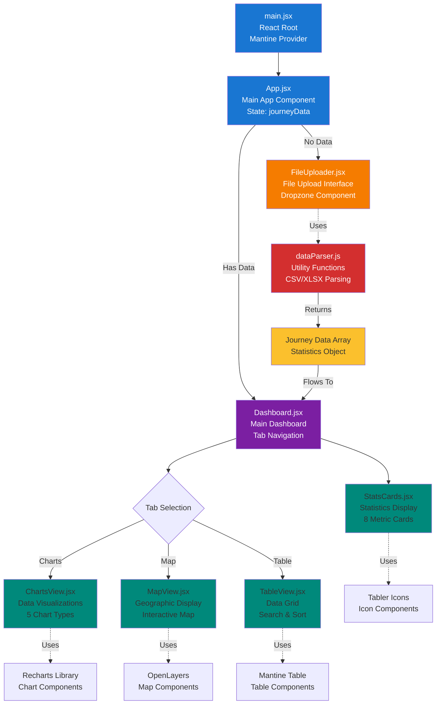

# Component Hierarchy - Polestar Journey Log Explorer

This diagram shows the React component structure and relationships.

---

**Author**: Kinn Coelho Juliao  
**Last Updated**: November 21, 2025
