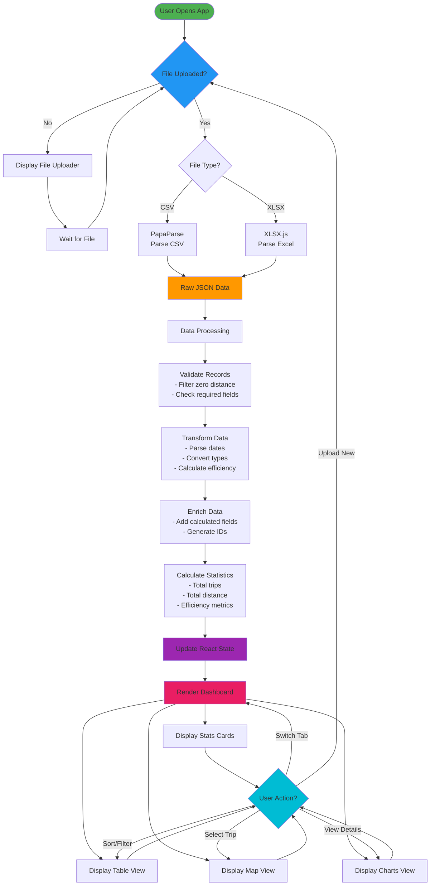

# Data Flow - Polestar Journey Log Explorer

This diagram shows how data flows through the application from upload to visualization.

---

**Author**: Kinn Coelho Juliao  
**Last Updated**: November 21, 2025
