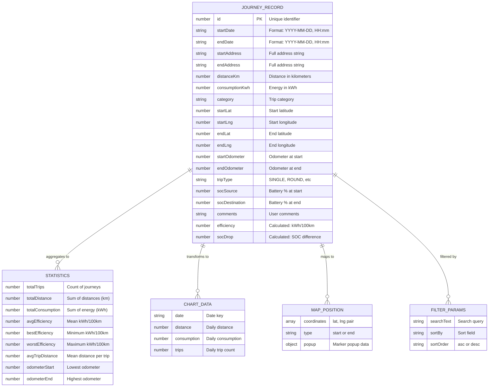
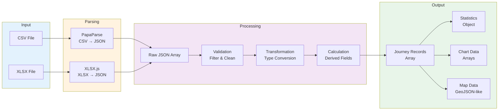

# Data Model - Polestar Journey Log Explorer

This diagram shows the data structures used throughout the application.

## Data Transformations

---

**Author**: Kinn Coelho Juliao  
**Last Updated**: November 21, 2025
