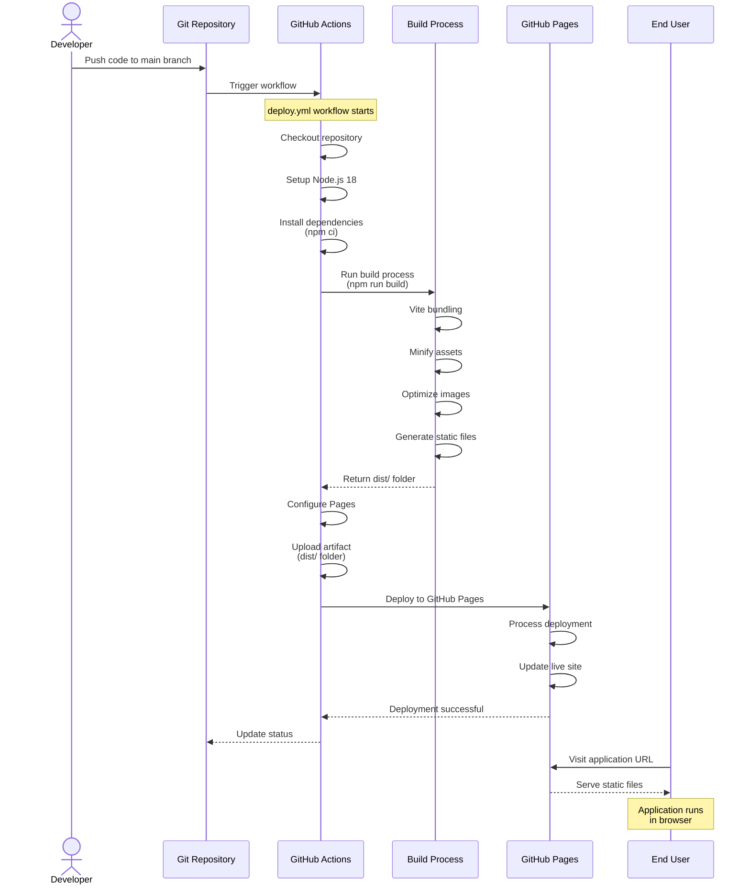
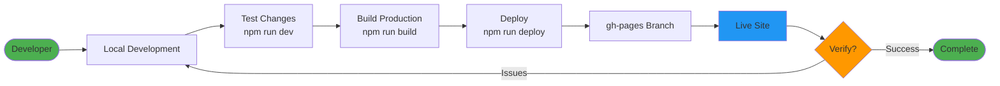

# Deployment Process - Polestar Journey Log Explorer

This diagram shows the CI/CD deployment workflow to GitHub Pages.

## Alternative: Manual Deployment

---

**Author**: Kinn Coelho Juliao  
**Last Updated**: November 21, 2025
