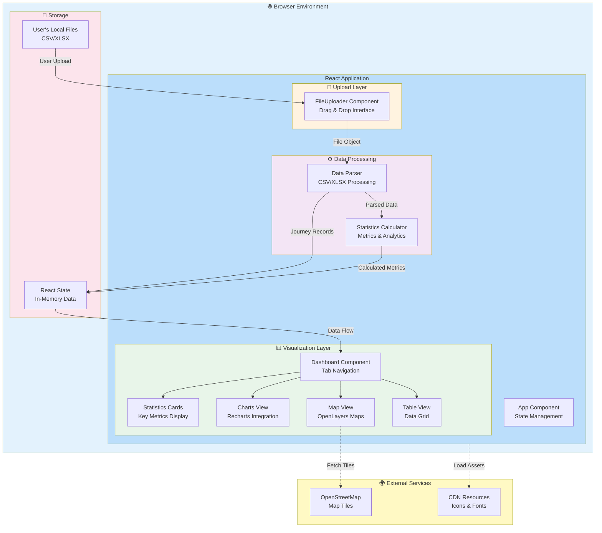

# System Architecture - Polestar Journey Log Explorer

This diagram illustrates the high-level architecture of the application.

---

**Author**: Kinn Coelho Juliao  
**Last Updated**: November 21, 2025
